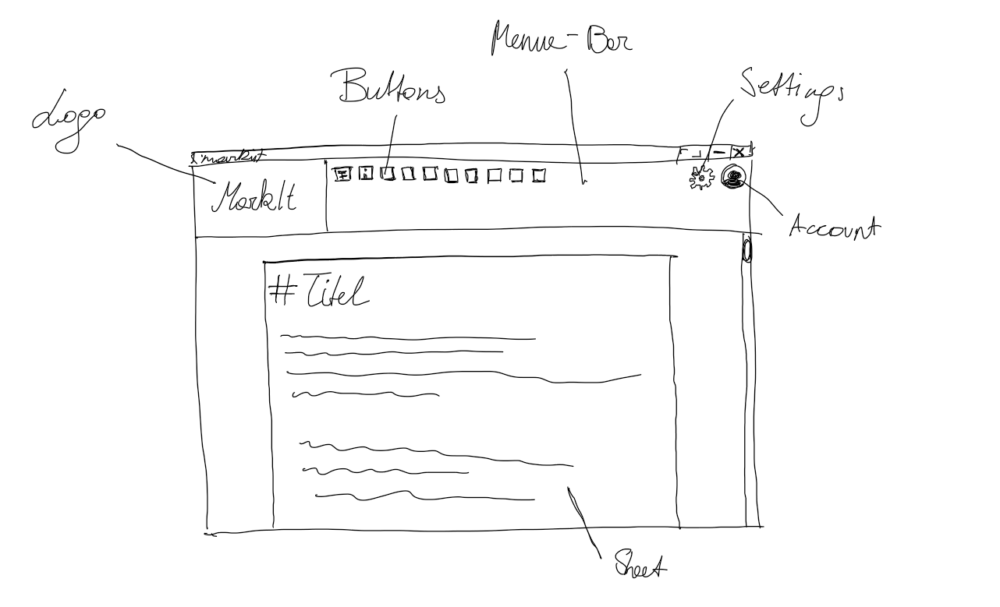
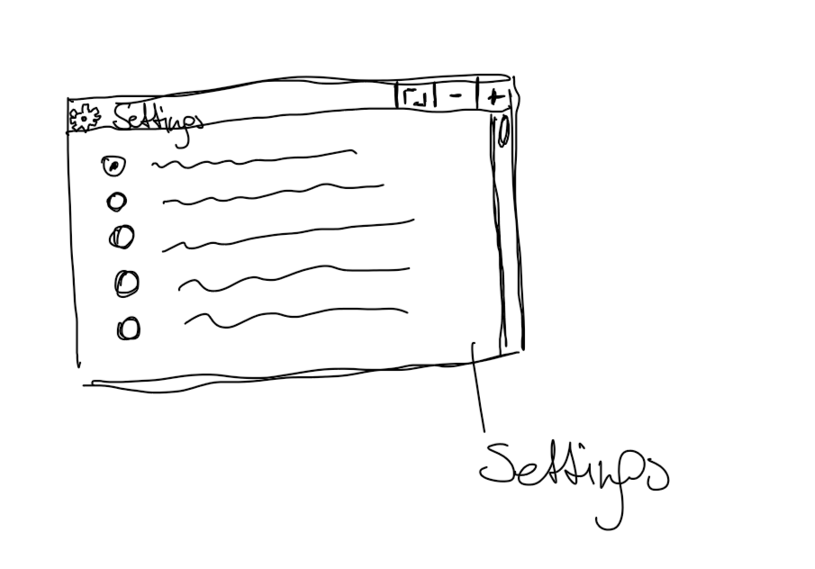
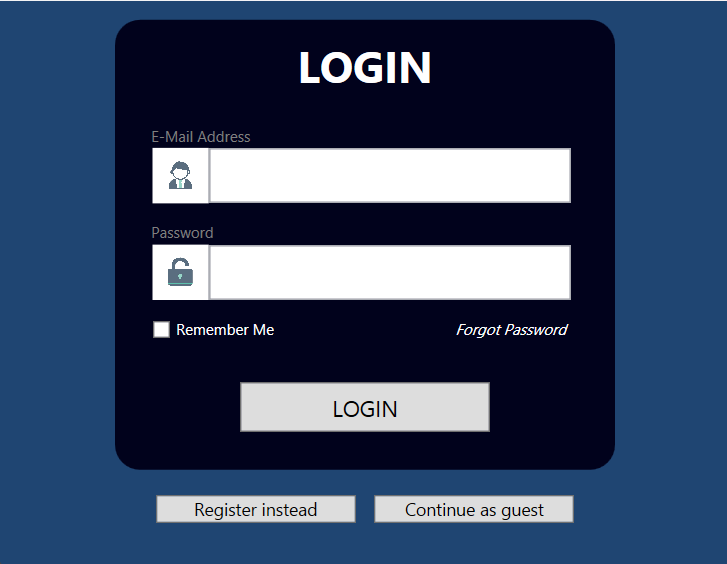

# MarkIt

- [MarkIt](#markit)
    - [Unsere Idee](#unsere-idee)
    - [Must-Haves](#must-haves)
    - [Nice-To-Haves](#nice-to-haves)
    - [Aufgabenteilung (circa)](#aufgabenteilung-circa)
        - [Roadmap](#roadmap)
    - [Server-Funktionen](#server-funktionen)
    - [Skizzen](#skizzen)
    - [Klassen-UML](#klassen-uml)

### Unsere Idee

**MarkIt** ist ein Texteditor für Markdown-Dateien. Als Grundprinzip orientieren wir uns an **MS Word**. Man kann ganz normal Dateien öffnen, schreiben und wieder speichern.
Man kann außerdem die **Basic-Markdown-Syntax** anwenden: Wenn man zum Beispiel auf einen Button klickt, wird der Text zu `**bold**`. Zu anderen Editoren unterscheidet sich unserer in einem wichtigen Punkt: JSON. Bei uns kann man mit einem Klick direkt das JSON-Format uebernehmen, also die {} oder [{}, {}]. 

### Must-Haves

* UI wie ein Texteditor (mit einem Feld zum Schreiben, ...)
* Lesen von Markdown-, Text- und JSON-Dateien
* Schreiben von Markdown-, Text- und JSON-Dateien
* Basic-Settings (Farbschema, Bildgröße, Textgröße, Speicherpfade, ...)
* Datei-Verlauf: Welche Dateien wurden zuletzt geöffnet/verwendet?
* Real-Time-Rendering
* Verschiedene User-Accounts (Supabase)
* 2-Faktor-Authentifizierung (Supabase)

### Nice-To-Haves

* Work-Together (Supabase)
* Bilder importieren (wie in VS Code)
* Cloud-Sync (Supabase)

### Aufgabenteilung (circa)

| Karim                      | Max                     |
| -------------------------- | ----------------------- |
| Settings                   | Cloud-Sync              |
| Lesen von Dateien          | Dokumentation & Planung |
| Schreiben von Dateien      | Datei-Verlauf           |
| WPF-UI mit Backend         | WPF-UI mit Backend      |
| 2-Faktor-Authentifizierung | User-Profile            |
| Work-Together              | Work-Together           |
| Real-Time-Rendering        | Real-Time-Rendering     |

##### [Roadmap](https://github.com/users/potexxi/projects/4/views/4)

### Server-Funktionen
Alle Server Sachen (Cloud-Sync, Userprofile, Work-Togheter...) machen wir alles ueber Supabase auf unserem eigenen Server. Supabase hat das ganze Backend fuer diese Funktionen schon. Wir haben nur Supabase installiert und aufgesetzt (Docker und die API).

### Skizzen

### Klassen-UML

@startuml
top to bottom direction
skinparam classAttributeIconSize 0
skinparam padding 1
skinparam nodesep 60
skinparam ranksep 60

class UserManager {
    + errorType : ErrorType
    --
    + UserManager()
    --
    + SignInAndHandleErrors(email : string, password : string): void
    + SignUpAndHandleErrors(email: string, password: string): void
    + GetRememberedUsers(): List<Session>
    + WriteToRememberedUsers(currentSession: session): void
}

enum ErrorType{
    Unknown
    OK
    ServerUnreachable
    PasswordFalse
    BadPassword
    BadEmail
    EmailExists
    Requests
}

UserManager ..> ErrorType

class Logger {
    + Logger : ILogger
    --
    + Init(): void
}

class ServerSettings {
    <u>+ Port: int {get; private set}
    <u>+ PublicIP: string {get; private set}
    --
    <u>+ Init(): void
}

class ServerManager{
    + serverStatus: ServerStatus
    --
    + ServerManager()
    --
    + InitSupabaseClient(): void
    + GetStatus(): ServerStatus
}

enum ServerStatus{
    On
    Off
    Unknown
}

ServerManager ..> ServerSettings
ServerManager ..> ServerStatus

class ClassUser{
    + Email: string {get ; set}
    + Password: string {get ; set}
    --
    + ClassUser(email: string, password:string)
}

class GeneralSettings{
    + Width: double {get ; private set}
    + Height: double {get ; private set}
    + Color: Brush {get ; private set}
    + Colors: List<Brush> {get ; private set}
    --
    + GeneralSettings()
    + GeneralSettings(width: double, height: double, color: Brush)
    --
    <u>+ LoadFromFile(filename: string): GeneralSettings
    + SaveToFile(filename: string): void
    + GetAllColors(): List<Brush>
    + ChangeColor(color: Brush): void
    + ChangeSize(width: double, height: double): void
    - setColorsFromFile(): void
}

class ColorTheme{
    + MenuBarColor: string
    + IconsColor: string
    + HoverColor: string
    + BackgroundColor: string
    + SliderColor: string
    --
    + ColorTheme(menuBarColor: string, iconsColor: string. hoverColor: string, backgroundColor:string, sliderColor: string)
}

GeneralSettings ..> ColorTheme

class ToolBar{
    - gridToolBar: Grid {get ; set}
    --
    + ToolBar()
    --
    - Init(): void
    + SetColorSchem(foreground:Color, background:Color): void
    + ButtonClick(): void
}

class Worksheet{
    - pages: List<Page> {get ; set}
    - zoom: double {get ; set}
    - gridWorksheet: Grid {get ; set}
    --
    + Worksheet(GridWorksheet)
    --
    + Render():void
    - findCurrentPage():void
    - Init()
}

class Page{
    - lines: List<string> {get ; set}
    - TextBoxesPage: List<Textbox>
    --
    + Page()
    + Page(contente: string)
    --
    + Render(): void;
    + ToString(): string
}

class WorksheetUtilities{
    --
    <u>+ findSymbole(content:string, symbole:char):List<char>
}

class WindowMessageBox{
    + returnType: ReturnType {get ; private set}
    + buttonType: ButtonType {get ; private set}
    --
    + WindowMessageBox(heading: string, content: string)
    + WindowMessageBox(heading: string, content: string, buttonType: ButtonType)
    --
    - DrawButtons(buttonType: ButtonType): void
}

enum ReturnType{
    Okay
    Yes
    No
}

enum ButtonType{
    Okay
    Yes
    No
}

WindowMessageBox ..> ReturnType
WindowMessageBox ..> ButtonType

Worksheet ..> Page

class FileManager{
    - userEmail: string
    - userPath: string
    + FileHistory: List<string> {get ; private set}
    + CurrentFilePath: string
    --
    + FileManager(userEmail: string)
    --
    - createUserFolder(): void
    - setFileHistory(): void
    + SaveToFile(filepath: string, content: string): void
    + LoadFromFile(filepath: string): string
    + AddToHistory(filepath: string): void
    - saveHistory(): void
}

' ChatGPT Anfang
' prompt: wie kann ich in plantuml diagramme untereinenader machen
UserManager -[hidden]-> Logger
Logger -[hidden]-> ServerSettings
ServerSettings -[hidden]-> ServerManager
ServerManager -[hidden]-> ClassUser
' ChatGPT ende

ClassUser -[hidden]-> Settings
Settings -[hidden]-> ToolBar
ToolBar -[hidden]-> Worksheet
Worksheet -[hidden]-> Page
Page -[hidden]-> WorksheetUtilities
WorksheetUtilities -[hidden]-> WindowMessageBox

@enduml